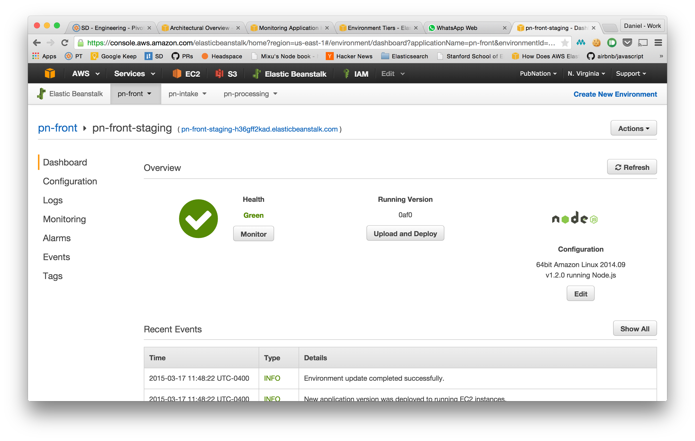

title: Elastic Beanstalk
author:
  name: Daniel Paz-Soldan
  twitter: danpazsoldan
  url: http://danpaz.github.io/eb-talk
output: index.html
controls: false
progress: true

--

# Elastic Beanstalk
## Rocking devops on AWS.

--

### Features

* Multiple environment configurations.
* Provisions resources sensibly.
* Autoscaling.
* Cloudwatch monitoring pre-configured out of the box.
* No additional charge above AWS resource usage.

--

### Turns this

Updating a configuration secret:

    # Update the config template.
    $ rake upload_cookbook[something]
    # Add variable to the EDB.
    $ rake databag:secret_edit[production,webapp_whatever]
    $ rake databag:secret_upload[production,webapp_whatever]
    # Restart workers.
    $ rake chef:client_run[*-app-2-not-app-*, production]
    $ rake chef:client_run[*-app-not-app-2-*, production]
    # Illegible log messages follow.

Deploying:

    $ grunt deploy:assets
    # Update deploy hash. Commit to monolithic ops repo.
    # Upload to hosted chef.
    $ knife data bag from file webapp_darwin deploy.json
    # Confirm you have the right nodes.
    $ rake chef:query["*-site-rw-*",production]
    # Confirm you have the right nodes.
    $ rake chef:query["*-site-rw-*",production]

--

### Into this

Updating a configuration secret:

    $ workon pn-processing
    $ eb setenv API_KEY=secret

Deploying:

    $ eb deploy
    # Boom.

--

### Node!

Supported versions as of March 31, 2015:
* 0.8.26
* 0.8.28
* 0.10.21
* 0.10.26
* 0.10.31
* 0.12.0

--

--

### Components (EB lingo)

#### Application
A logical collection of Elastic Beanstalk components, conceptually similar to a
folder.

#### Application Version
A labeled zipped file of deployable code. Stored on S3 and labelled by the git
commit hash.

#### Environment
A single application version that is deployed onto AWS resources, labeled by an
environment name. For example, we typically have a Staging and a Production
environment.

#### Environment Configuration
A collection of settings and parameters that define how an environment behaves,
including process environment variables.

#### Environment Tiers
Either a *Web Server* that handles HTTP requests, or a *Worker* that handles
background processing tasks.

--

### Batteries not included

Every EB application comes with:

* 1 Elastic Load Balancer
* 1 Autoscaling group
* 1+ EC2 instances
* 1 security group
* CNAME to load balancer url
* Cloudwatch metrics
* Rotating logs stored in S3
* For worker tier: 1 SQS queue

--

--

### eb cli

    $ eb -h
    commands:
       clone       Clones an environment.
       config      Edits the environment configuration settings.
       console     Opens the environment in the AWS Elastic Beanstalk Management Console.
       create      Creates a new environment.
       deploy      Deploys your source code to the environment.
       events      Gets recent events.
       init        Initializes your directory with the EB CLI. Creates the application.
       list        Lists all environments.
       logs        Gets recent logs.
       open        Opens the application URL in a browser.
       printenv    Shows the environment variables.
       scale       Changes the number of running instances.
       setenv      Sets environment variables.
       ssh         Opens the SSH client to connect to an instance.
       status      Gets environment information and status.
       terminate   Terminates the environment.
       use         Sets default environment.

--

# Demo

--

# Bonus slides
## Things that are hard.

--

### Identity management

--

### Customization

* Non-amazon services?
* Node and python on the same server?
